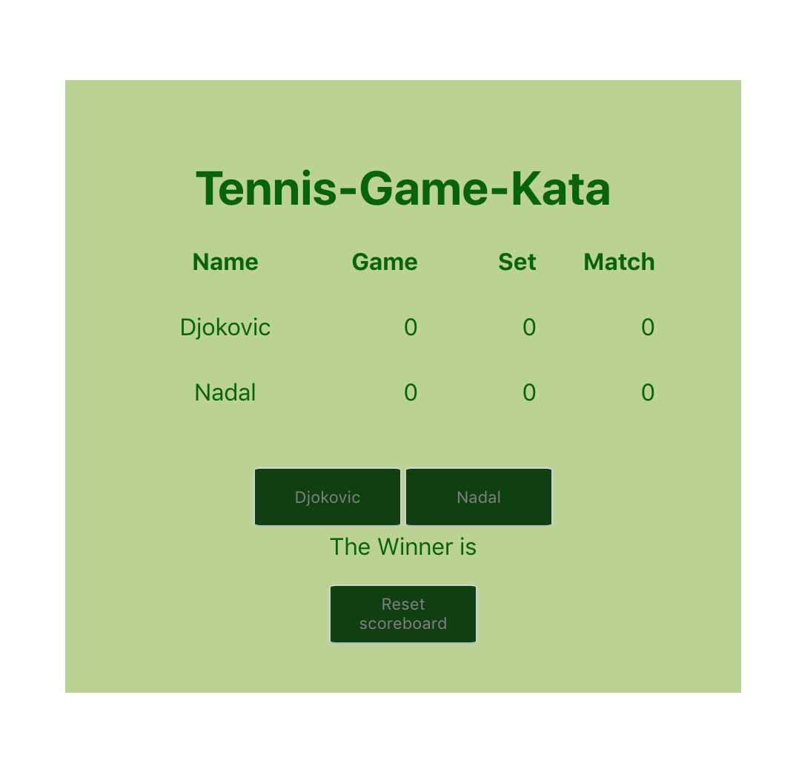

## Tennis game kata

The logic of a tennis-game and front-end rendering in React part of my 3-month internship June-Sept 2019. The key learning objectives were to understand the difference between factory functions, object-oriented programming, basic testing syntax in jasmine.js and the use and benefits of Typescript with Javascript. The final step was to use the React-library to render the game with a front-end ui.

The read-me focuses on the process of learning and embedding programming skills.



### Table of Contents

- Katas: A brief background
- Game logic in pseudo code
- TDD - writing tests and code for tests to pass
- Factory-functions converted to a game state using
- Class-based game moved to the React library - set up
- Render & conditional rendering in React

#### Katas: A brief background

Kata is a Japanese word, from martial arts training, which loosely interpreted for coding refers to the form, order and process of doing things repetitively so that an intuitive understanding of the techniques used become part of the warp and weft of the way one codes.

Katas are practiced in software engineering as a part of procedural learning - or performing complex operations again and again, until it is embedded in the writers' unconscious memory. Methods, in software engineering, by working on engineering katas help the engineer access these methods without conscious exertion, control or attention.

The stages involved in the coding process of learning are - attempt, fail, analyze the resutl, decide how to change the approach so that the next step is more successful.

The aim of the kata is about understanding the process, practising that process and improving it and not obsessively worrying about solution, as the process is the solution.

Overanalysing the process can lead to "choking" or the anxiety over finding the perfect solution and "perform well" that leads actually to the deterioration of the learning process.

More on katas from Wikipedia (https://en.wikipedia.org/wiki/Kata)

The tennis kata from Coding Dojo: The description of the kata provided by Coding Dojo is in this link (http://codingdojo.org/kata/Tennis/). The logic from this Dojo is described below in pseudo code with the solution in js and the ui in react.js

#### Game logic in pseudo code (acceptance criteria)

- the game has two players
- scores start at 0-0
- scores should update to 15-0 when player one scores a point
- and to 0-15 when player 2 wins a point
- a running score should be maintained based on the score sequence
- the score sequence is 0, 15, 30, 40,50, 60
- the deuce exception is when scores are 50-50
- scores return to 40-40 when they are 50-50
- a game is won when one player is at 50 or 60 and the other is two points behind
- winning a game earns the player one set point
- 1-0 is when the first player wins a set
- 0-1 is when the first player wins a set
- when a set is won, game scores revert to 0-0
- players continue to win games and sets
- the first player to win 7 sets earns a match point
- player one wins a match at 1-0
- player two wins a match at 0-1
- set & game points go back to 0-0 when a match is won
- the first player past 3 matches wins the game
- the name of the winner is printed on the board
- the games, sets, matches reset to 0-0 respectively

#### TDD - code snippets of tests run

Test driven development - TDD is also a repetiton-driven method to test software written passes small unit tests.

Kent Beck, an American software developer is credited with starting the practice and aims to keep development simple, robust and repeatable based on the confidence that unit tests are passed.

Once tests are passed, the developer is confident that the software logic is proven to meet requirements of the user.

It may appear to the developer slower at the start but significantly reduces debugging time as the code base gets more complex. It is specifically useful in end-to-end testing where the code and its dependency on other parts of an app can be tested seamlessly in small, iterative steps.

The process in TDD is to write test, see the test fail, write code, run tests, see the code pass, write as many tests to check all scenarios of the user experience, refactor code to make it readable, lower run-time and make it more maintainable.

jasmine.js has been used to run the TDD for this kata. Some snippets below:-

```
it('should start both players with a score of 0-0', () => {
  const game = new TennisGame();
  expect(game.score()).toEqual([0, 0]);
});
it('should update scores to 15-0 when playerOne scores', () => {
  const game = new TennisGame();
  game.playerONeAddPoint();
  expect(game.score()).toEqual([15, 0]);
});
it('should update score to 0-15 when playerTwo scores', () => {
  const game = new TennisGame();
  game.playerTwoAddPoint();
  expect(game.score()).toEqual([0, 15]);
});
```

Exception handling test

```
it('should set score back to 40-40 on the deuce exception', () => {
  const game = new TennisGame([40, 50]);
  game.playerOneAddPoint();
  expect(game.score()).toEqual([40, 40]);
});
```

Win conditions

```
it('a playerOne should win game if score 50-30', () => {
  const game = new TennisGame([40, 30]);
  game.playerOneWinGame();
  expect(game.score()).toEqual([50, 30]);
});
it('a playerTwo should win game if score 30-50', () => {
  const game = new TennisGame([30, 40]);
  game.playerTwoWinGame();
  expect(game.score()).toEqual([30, 50]);
});
```

reset game conditions

```
it('should set scores to 0-0 if playerOne or playerTwo wins game', () => {
  const game = new TennisGame([50, 30]);
  game.playerOneWinGame();
  expect(game.score()).toEqual([0, 0]);
});

it('should set scores to 0-0 if playerOne or playerTwo wins game', () => {
  const game = new TennisGame([30, 50]);
  game.playerTwoWinGame();
  expect(game.score()).toEqual([0, 0]);
});
```

### Factory-functions converted to a game state using classes and constructors

As part of the TDD, factory functions in vanilla js were written to pass tests, these factory functions were converted into a class-based game-state to understand how React.js as a library works under the hood, a class was created, so that the game could be played again and again under the same conditions as a 'new' TennisGame

```
export default class TennisGame {
  gameState; //: GameState;

  constructor(properties) {
    this.gameState = {
      playerOne: properties.playerOne,
      playerTwo: properties.playerTwo,
      playerOneGame: 0,
      playerOneSet: 0,
      playerOneMatch: 0,
      playerTwoGame: 0,
      playerTwoSet: 0,
      playerTwoMatch: 0,
      winnerGameSetAndMatch: ''
    };
  }

  playerOneScored() {
    this.gameState.playerOneGame = this.gameState.playerOneGame + 1;
    const isDeuce = this.hasPlayerReachedDeuce(
      this.gameState.playerOneGame,
      this.gameState.playerTwoGame
    );

    if (isDeuce) {
      this.gameState = {
        ...this.gameState,
        playerOneGame: 3,
        playerTwoGame: 3
      };
    } else {
      const hasPlayerWonGame = this.hasPlayerWonGame(
        this.gameState.playerOneGame,
        this.gameState.playerTwoGame
      );

      if (hasPlayerWonGame) {
        this.gameState = {
          ...this.gameState,
          playerOneGame: 0,
          playerTwoGame: 0,
          playerOneSet: this.gameState.playerOneSet + 1
        };

        const hasPlayerWonSet = this.hasPlayerWonSet(
          this.gameState.playerOneSet,
          this.gameState.playerTwoSet
        );

        if (hasPlayerWonSet) {
          this.gameState = {
            ...this.gameState,
            playerOneSet: 0,
            playerTwoSet: 0,
            playerOneMatch: this.gameState.playerOneMatch + 1
          };

          const hasAnyPlayerWonMatch = this.hasAnyPlayerWonMatch(
            this.gameState.playerOneMatch,
            this.gameState.playerTwoMatch
          );

          if (hasAnyPlayerWonMatch) {
            this.gameState = {
              ...this.gameState,
              playerOneMatch: 0,
              playerTwoMatch: 0,
              winnerGameSetAndMatch: this.getWinnerName(
                this.gameState.playerOneMatch,
                this.gameState.playerTwoMatch
              )
            };
          }
        }
      }
    }
  }

  playerTwoScored() {}

  hasPlayerReachedDeuce(playerOneScore, playerTwoScore) {
    if (playerOneScore === 4 && playerTwoScore === 4) {
      return true;
    } else {
      return false;
    }
  }

  hasPlayerWonGame(playerOneGameScore, playerTwoGameScore) {
    if (playerOneGameScore === 4 && playerTwoGameScore < 3) {
      return true;
    } else if (playerOneGameScore === 5 && playerTwoGameScore <= 3) {
      return true;
    } else {
      return false;
    }
  }
```

#### Class-based game moved to the React library - set up

React is a JavaScript library that can be used to build user interfaces. While the tennis game in a class-based object can be rendered in HTML and with vanilla javascript, accessing the DOM is much easier with the React Library.

The React app, creates components and these components display data that changes over time by accessing a virtual document-object-model (DOM).

The create-react-app creates HTML-like elements (JSX) that are transpiled by the library from JSX back into vanilla JavaScript. Using the create-react-app accesses Bable (the transpiler) and all the methods baked into the React library.

- npm-x create-react-app tennis-game
- cd into folder - yarn start
- remove react branding from css/jsx in app.js
- add h1 jsx tag Tennis Game Kata in app.js
- create components folder
- Set up a basic component - rce tab for the game tennis-game.js
- Styling for the game is in app.css

The index.js file renders the whole app into the HTML-DOM

The App.js file is basic as it derives inputs from the components imported to the page

```
import React from 'react';
import './App.css';
import TennisGame from './components/tennis-game'

function App() {
  return (
    <div className="tennis-game-app">
      <header className="ScoreBoard">
    <h1>Tennis-Game-Kata</h1>
        <TennisGame />
      </header>
    </div>
  );
}

export default App;
```

#### Rendering and returning jsx elements

- test render is working with one div and a h1 jsx tag
- the render structure is a parent div with a class name coloumn
- add children - rows to display names of players, scores
- children of rows - span to display scores
- Buttons to advance scores of the individual players
- A paragraph to display winner and a span to display the winner name
- A button for the js garbage collector to clear the game down

Inspect the elements in the console to ensure the methods used displayed in the right jsx element

#### Styling in app.css

- Basic styling using flex box to align items

### Intializing the game

The class of TennisGame is initialized with the scores that the players can achieve in a game, set and match.

- the game sequence for the progression of points of a game
- the set sequence for the progression of sets won to win a match
- the match sequence for the number of games a player must win to win game, set and match

```
export class TennisGame extends Component {
  gameSequence = [0, 15, 30, 40, 50, 60];
  setSequence = [0, 1, 2, 3, 4, 5, 6, 7];
  matchSequence = [0, 1, 2, 3];

```

The constructor properties are held in state as an object - this defines the data that changes as the game progresses

```
constructor(properties) {
  super(properties);

  this.state = {
    playerOne: 'Djokovic',
    playerTwo: 'Nadal',
    playerOneGame: 0,
    playerOneSet: 0,
    playerOneMatch: 0,
    playerTwoGame: 0,
    playerTwoSet: 0,
    playerTwoMatch: 0
  };
}
```

- the key function is to change state from 0-0 to advance points through the game
- conditions and functions determine these state changes (changes of scores)
- if the player won a point?

```
playerOneScored(){}
playerTwoScored(){}

```

- if the player won a game?
- if the player won a set?
- the function is run, state is reset and then the jsx element is condtionally rendered with the new state

```
hasPlayerWonSet(playerASet, playerBSet) {
   if (playerASet === 6 && playerBSet <= 4) {
     return true;
   } else if (playerASet === 7 && playerBSet <= 5) {
     return true;
   } else {
     return false;
   }
 }
    if (
       this.hasPlayerWonSet(
         this.setSequence[this.state.playerTwoSet],
         this.setSequence[this.state.playerOneSet]
       )
     ) {
       this.setState({
         playerOneGame: 0,
         playerTwoGame: 0,
         playerOneSet: 0,
         playerTwoSet: 0,
         playerTwoMatch: this.state.playerTwoMatch + 1
       });
     }

```

### Handling exceptions

- the deuce exception breaks a pattern, therefore, a conditional code block is run to check if the players have reached the deuce exception

```
hasPlayerReachedDeuce(playerAGame, playerBGame) {
    if (playerAGame === 50 && playerBGame === 50) {
      return true;
    } else {
      return false;
    }
  }
```

once this break of the iterative pattern is established then an action follows returning scores in state to 40-40, this is a position in the array with an index of 3

```
    if (
        this.hasPlayerReachedDeuce(
          this.gameSequence[this.state.playerTwoGame],
          this.gameSequence[this.state.playerOneGame]
        )
      ) {
        this.setState({
          playerOneGame: 3,
          playerTwoGame: 3
        });
      }

```

    The final step is to find a winner by comparing scores and print the winner's name on the board. Once the winner has been declared, the scoreboard is cleared down to the start of a new game and returnsthe gamestate to the original state when the game starts with scores at zero and the winner removed.

```
      <div className='row inputs'>
        <button onClick={() => currentGame.playerOneScored()}>
          {currentGame.getPlayerOneName()}
        </button>
        <button onClick={() => currentGame.playerTwoScored()}>
          {currentGame.getPlayerTwoName()}
        </button>
      </div>
      <div>
        <p>
          <span className='winner-name'>
            {currentGame.getPreviousWinner() !== ''
              ? `Game, Set & Match to ${currentGame.getPreviousWinner()}.`
              : ''}
          </span>
        </p>
      </div>
      <div>
        <button onClick={() => currentGame.reset()}>
          Reset scores and players
        </button>
      </div>
    </div>
  );
};
```
